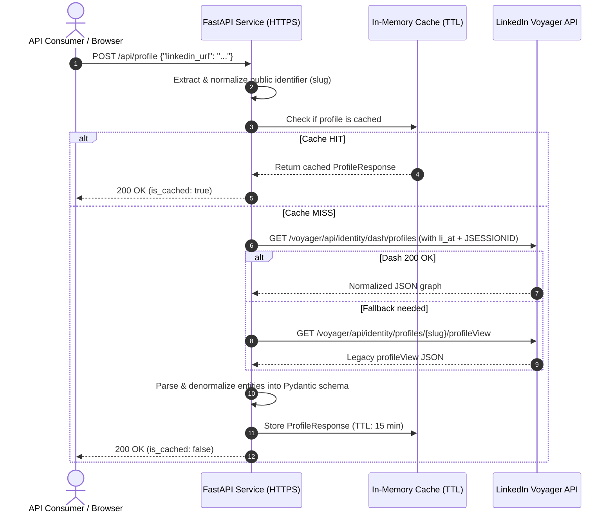

# LinkedIn Profile Scraper API (Reverse-Engineered Voyager API)

A high-performance, reverse-engineered REST API that accepts a LinkedIn profile URL and returns comprehensive structured JSON directly from LinkedIn's internal Voyager endpoints — **without using a browser or headless browser automation (Puppeteer/Selenium/Playwright)**.

Built with **FastAPI**, **httpx (async)**, and **Pydantic v2**. Fully deployable over public **HTTPS** (via Render, Railway, or Docker).

---

## 🌐 Live Hosted API (Public HTTPS)

- **Base API URL**: `https://syracuse-subscriber-settled-suspension.trycloudflare.com`
- **Interactive Swagger Docs**: [`https://syracuse-subscriber-settled-suspension.trycloudflare.com/docs`](https://syracuse-subscriber-settled-suspension.trycloudflare.com/docs)
- **Interactive ReDoc**: [`https://syracuse-subscriber-settled-suspension.trycloudflare.com/redoc`](https://syracuse-subscriber-settled-suspension.trycloudflare.com/redoc)
- **Health Check**: [`https://syracuse-subscriber-settled-suspension.trycloudflare.com/health`](https://syracuse-subscriber-settled-suspension.trycloudflare.com/health)

### Quick cURL Example
```bash
curl -X POST "https://syracuse-subscriber-settled-suspension.trycloudflare.com/api/profile" \
  -H "Content-Type: application/json" \
  -d '{"linkedin_url": "https://www.linkedin.com/in/williamhgates/"}'
```

---

## 🌟 Key Features

- **Pure Reverse-Engineered HTTP Calls**: Directly interfaces with LinkedIn's internal **Voyager REST API** (`/identity/dash/profiles` and legacy `/identity/profiles/{id}/profileView`), achieving response times in milliseconds without the memory footprint and fragility of browser automation.
- **Comprehensive Profile Extraction**:
  - **Core Info**: First name, last name, full name, headline, location, summary / about, industry
  - **High-Resolution Media**: Profile picture URL (extracted from highest-resolution `VectorImage` artifact), background / banner image URL
  - **Experience**: Title, company name, company LinkedIn URL, company logo, location, employment type, start/end dates (with current job detection), role description
  - **Education**: School name, degree, field of study, school logo, start/end dates, activities, notes
  - **Skills**: Verified skill names
  - **Certifications & Licenses**: Name, issuing authority, credential URL, license number, dates
  - **Languages**: Language name and proficiency level
  - **Supplementary Sections**: Volunteer experience, honors/awards, featured projects
- **Dual-Engine Normalization**: Seamlessly parses both LinkedIn's modern Dash normalized graph format (`included` entities) and legacy `profileView` responses.
- **In-Memory TTL Caching**: Prevents redundant hits to LinkedIn and protects account limits with a configurable TTL cache.
- **Type-Safe Validation**: Powered by Pydantic v2 schemas and FastAPI automated OpenAPI documentation (Swagger UI & ReDoc).
- **Zero-Secret Repo**: Fully configurable via environment variables (`.env`). Secrets and session cookies are strictly excluded via `.gitignore`.

---

## 📐 Architecture & Request Flow



---

## 🔬 Reverse Engineering Approach

LinkedIn’s web and mobile applications do not rely on public OAuth APIs; they communicate with a private, internal service called **Voyager**. By replicating browser network semantics, our client communicates directly with Voyager:

### 1. Authentication & Headers
LinkedIn’s internal API relies on session cookie authentication paired with CSRF prevention:
- **`li_at`**: The core authentication session cookie issued upon user login.
- **`JSESSIONID`**: The session identifier. LinkedIn requires its value (stripped of quotes) in the `csrf-token` header to prevent CSRF attacks.
- **`x-restli-protocol-version: 2.0.0`**: Declares Rest.li protocol version 2.0.
- **`accept: application/vnd.linkedin.normalized+json+2.1`**: Requests LinkedIn’s normalized entity graph.

### 2. Endpoints Hit
- **Primary (Dash API)**:  
  `GET https://www.linkedin.com/voyager/api/identity/dash/profiles?q=memberIdentity&memberIdentity={slug}&decorationId=com.linkedin.voyager.dash.deco.identity.profile.FullProfileWithEntities-35`  
  Returns a normalized JSON graph with an `included` array containing all profile entities (`Profile`, `Position`, `Education`, `Skill`, `Certification`, `Language`).
- **Fallback (Legacy ProfileView)**:  
  `GET https://www.linkedin.com/voyager/api/identity/profiles/{slug}/profileView`  
  Returns a monolithic profile object containing `positionGroupView`, `educationView`, `skillView`, etc.
- **Resilience Fallback (Public Meta)**:  
  If internal endpoints encounter an unexpected challenge, the client extracts embedded JSON-LD (`schema.org/Person`) metadata from public HTML as a fallback.

### 3. Image Resolution Extraction
LinkedIn stores images as `VectorImage` objects with multiple resolution artifacts:
```json
{
  "rootUrl": "https://media.licdn.com/dms/image/v2/...",
  "artifacts": [
    {"width": 100, "height": 100, "fileIdentifyingUrlPathSegment": "100_100/..."},
    {"width": 800, "height": 800, "fileIdentifyingUrlPathSegment": "800_800/..."}
  ]
}
```
The parser automatically calculates dimensions, selects the largest artifact, and constructs the highest-resolution direct image URL (`rootUrl + segment`).

---

## 📡 API Reference

### Interactive Documentation
Once running, interactive API docs are accessible at:
- **Swagger UI**: `/docs`
- **ReDoc**: `/redoc`
- **OpenAPI Schema**: `/openapi.json`

---

### Endpoints

#### 1. Scrape Profile (`POST /api/profile`)
**Request Body**:
```json
{
  "linkedin_url": "https://www.linkedin.com/in/williamhgates/"
}
```
*Accepts full LinkedIn URLs, country subdomains (`in.linkedin.com`), trailing slashes, or raw slugs (`williamhgates`).*

#### 2. Scrape Profile via GET (`GET /api/profile`)
```
GET /api/profile?url=https://www.linkedin.com/in/williamhgates/
```

---

### Response Schema (`ProfileResponse`)

```json
{
  "public_identifier": "williamhgates",
  "profile_url": "https://www.linkedin.com/in/williamhgates/",
  "first_name": "Bill",
  "last_name": "Gates",
  "full_name": "Bill Gates",
  "headline": "Co-chair, Bill & Melinda Gates Foundation",
  "location": "Seattle, Washington, United States",
  "about": "Co-chair of the Bill & Melinda Gates Foundation. Founder of Breakthrough Energy. Co-founder of Microsoft. Voracious reader. Avid traveler. Active blogger.",
  "industry": "Philanthropy",
  "profile_picture_url": "https://media.licdn.com/dms/image/v2/D4E03AQE/profile-displayphoto-shrink_800_800/...",
  "background_image_url": "https://media.licdn.com/dms/image/v2/D4E16AQH/profile-displaybackgroundimage-shrink_350_1400/...",
  "connections_count": null,
  "follower_count": null,
  "experience": [
    {
      "title": "Co-chair",
      "company_name": "Bill & Melinda Gates Foundation",
      "company_linkedin_url": "https://www.linkedin.com/company/bill-melinda-gates-foundation/",
      "company_logo_url": "https://media.licdn.com/dms/image/v2/.../logo.jpg",
      "location": "Seattle, WA",
      "employment_type": "Full-time",
      "start_date": {
        "year": 2000,
        "month": null,
        "day": null,
        "formatted": "2000"
      },
      "end_date": null,
      "is_current": true,
      "description": "Guided by the belief that every life has equal value, the Bill & Melinda Gates Foundation works to help all people lead healthy, productive lives."
    }
  ],
  "education": [
    {
      "school_name": "Harvard University",
      "school_linkedin_url": "https://www.linkedin.com/school/harvard-university/",
      "school_logo_url": "https://media.licdn.com/dms/image/v2/.../harvard.jpg",
      "degree": "Applied Mathematics",
      "field_of_study": "Computer Science & Mathematics",
      "start_date": {
        "year": 1973,
        "month": null,
        "day": null,
        "formatted": "1973"
      },
      "end_date": {
        "year": 1975,
        "month": null,
        "day": null,
        "formatted": "1975"
      },
      "grade": null,
      "activities": null,
      "description": null
    }
  ],
  "skills": [
    {
      "name": "Philanthropy"
    },
    {
      "name": "Software Development"
    },
    {
      "name": "Strategic Planning"
    }
  ],
  "certifications": [
    {
      "name": "Honorary Doctorate",
      "authority": "Harvard University",
      "url": null,
      "license_number": null,
      "start_date": {
        "year": 2007,
        "month": 6,
        "day": null,
        "formatted": "2007-06"
      },
      "end_date": null
    }
  ],
  "languages": [
    {
      "name": "English",
      "proficiency": "NATIVE_OR_BILINGUAL"
    }
  ],
  "volunteer_experience": [],
  "honors": [],
  "projects": [],
  "fetched_at": "2026-08-29T03:00:00.000000Z",
  "is_cached": false
}
```

---

## 🚀 Getting Started & Local Setup

### Prerequisites
- Python 3.10+
- A LinkedIn account (⚠️ **recommendation: use a throwaway/burner account**)

### 1. Clone & Set Up Virtual Environment

```bash
git clone https://github.com/your-username/linkedin-profile-api.git
cd linkedin-profile-api

# Create and activate virtual environment
python -m venv .venv

# On Linux/macOS:
source .venv/bin/activate

# On Windows (PowerShell):
.\.venv\Scripts\Activate.ps1
```

### 2. Install Dependencies

```bash
pip install -r requirements.txt
```

### 3. Configure Credentials

Copy `.env.example` to `.env`:

```bash
cp .env.example .env
```

#### How to obtain your LinkedIn cookies:
1. Open Google Chrome, Brave, Edge, or Firefox.
2. Go to [linkedin.com](https://www.linkedin.com) and log into your (throwaway) account.
3. Open **Developer Tools** (`F12` or `Ctrl+Shift+I` / `Cmd+Option+I`).
4. Click on the **Application** tab (or **Storage** in Firefox) $\rightarrow$ expand **Cookies** $\rightarrow$ select `https://www.linkedin.com`.
5. Locate and copy:
   - `li_at`: A long alphanumeric string (e.g., `AQEDAR...`).
   - `JSESSIONID`: The CSRF token (e.g., `"ajax:1234567890123456789"`).
6. Paste them into `.env`:
   ```env
   LINKEDIN_LI_AT=AQEDAR...
   LINKEDIN_JSESSIONID=ajax:1234567890123456789
   ```

### 4. Run the Development Server

```bash
uvicorn app.main:app --reload --host 0.0.0.0 --port 8000
```

Access the API at `http://localhost:8000`.  
Explore the interactive docs at `http://localhost:8000/docs`.

---

## 🧪 Testing

The repository includes a comprehensive test suite covering parser logic, legacy format, Dash normalized graph format, endpoint handling, and TTL caching:

```bash
pytest -v
```

Output:
```
tests/test_api.py::test_root_endpoint PASSED
tests/test_api.py::test_health_endpoint PASSED
tests/test_api.py::test_post_profile_success PASSED
tests/test_api.py::test_caching_behavior PASSED
tests/test_api.py::test_get_profile_endpoint PASSED
tests/test_api.py::test_profile_not_found PASSED
tests/test_api.py::test_rate_limited PASSED
tests/test_api.py::test_empty_url_validation_error PASSED
tests/test_profile_parser.py::test_extract_image_url PASSED
tests/test_profile_parser.py::test_parse_date_point PASSED
tests/test_profile_parser.py::test_parse_date_range PASSED
tests/test_profile_parser.py::test_parse_legacy_profile_view PASSED
tests/test_profile_parser.py::test_parse_dash_normalized_profile PASSED

======================== 13 passed in 0.58s ========================
```

---

## 🌐 Public HTTPS Deployment

### Option A: Render (Recommended — Free Tier with Automatic HTTPS)

1. Push this repository to GitHub.
2. Sign in to [Render.com](https://render.com).
3. Click **New +** $\rightarrow$ **Web Service**.
4. Connect your GitHub repository.
5. Configure the settings:
   - **Environment**: `Python 3`
   - **Build Command**: `pip install -r requirements.txt`
   - **Start Command**: `uvicorn app.main:app --host 0.0.0.0 --port $PORT`
6. In **Environment Variables**, add:
   - `LINKEDIN_LI_AT`: Your session cookie
   - `LINKEDIN_JSESSIONID`: Your CSRF cookie
   - `CACHE_ENABLED`: `true`
   - `CACHE_TTL_SECONDS`: `900`
7. Click **Create Web Service**.
8. Render will provision an HTTPS endpoint (e.g., `https://linkedin-profile-api-xxxx.onrender.com`).

*(A turnkey [`render.yaml`](render.yaml) Blueprint is included in this repository for automatic deployment).*

---

### Option B: Docker Container

Build and run anywhere with Docker:

```bash
# Build image
docker build -t linkedin-profile-api .

# Run container
docker run -d \
  -p 8000:8000 \
  --env-file .env \
  --name linkedin-api \
  linkedin-profile-api
```

---

## ⚠️ Known Limitations & Risks

1. **LinkedIn Voyager API Changes**: Voyager is an undocumented, internal API. LinkedIn frequently updates frontend decorations and schemas without warning. The parser includes multiple fallback strategies, but maintenance is periodically required.
2. **Session Cookie Expiration**: The `li_at` session cookie is long-lived (typically several months to a year), but LinkedIn can invalidate it if anomalous activity is detected or if a security checkpoint is triggered.
3. **Rate Limits & Anti-Bot Protections**: Excessive rapid queries from the same IP or account may trigger HTTP `429 Too Many Requests` or temporary verification challenges. The API includes built-in in-memory caching (`TTLCache`) to reduce redundant requests. For production scale, proxy rotation is recommended.
4. **Account Suspension Risk**: Reverse-engineering LinkedIn APIs violates LinkedIn's Terms of Service. **Never use your personal or primary LinkedIn account.** Always use a dedicated burner/test account.
5. **Private Profiles**: Profiles configured with private visibility by the user will return only public metadata.

---

## 📄 License

MIT License. Educational and demonstration purposes only. Use responsibly and in accordance with applicable laws and platform policies.
