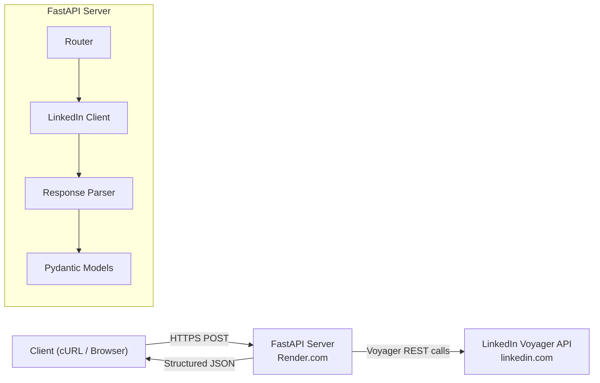

# LinkedIn Profile API — Implementation Plan

Build a publicly hosted REST API that accepts a LinkedIn profile URL and returns structured profile data as JSON, by reverse-engineering LinkedIn's internal Voyager API.

---

## User Review Required

> [!WARNING]
> **LinkedIn Terms of Service**: This project reverse-engineers LinkedIn's private Voyager API. This violates LinkedIn's ToS and may result in account suspension. Use a **throwaway/burner** LinkedIn account — never your primary account.

> [!IMPORTANT]
> **Credentials**: You will need to provide a `li_at` session cookie and `JSESSIONID` from a logged-in LinkedIn session. These are stored as environment variables and never committed to the repo.

---

## Open Questions

1. **Which LinkedIn account will you use?** — Do you already have a throwaway account, or should the setup instructions cover creating one?
2. **Deployment platform preference?** — The plan defaults to **Render** (free tier, auto-HTTPS). Alternatives: Railway (trial credits), Fly.io (paid), or any VPS. Do you have a preference?
3. **Rate limiting / caching?** — Should the API include in-memory caching (e.g., TTL-based) to avoid hitting LinkedIn repeatedly for the same profile? Recommended: yes, with a 15-minute TTL.
4. **Authentication on our API?** — Should the hosted API itself require an API key for callers, or be fully open?

---

## Architecture Overview



---

## Tech Stack

| Layer | Choice | Rationale |
|-------|--------|-----------|
| Language | **Python 3.11+** | Rich ecosystem, fast prototyping |
| Framework | **FastAPI** | Async, auto-docs (Swagger/ReDoc), Pydantic validation |
| HTTP Client | **httpx** (async) | Modern async HTTP, connection pooling |
| Data Models | **Pydantic v2** | Type-safe response schemas, JSON serialization |
| Server | **Uvicorn** | ASGI, production-ready |
| Deployment | **Render** (free tier) | Auto-HTTPS, GitHub integration, zero config |
| Caching | **cachetools** (TTL) | In-memory, no external deps |

---

## Proposed Changes

### 1. Project Structure

```
d:\tross\
├── app/
│   ├── __init__.py
│   ├── main.py              # FastAPI app entry point
│   ├── config.py             # Settings (env vars via pydantic-settings)
│   ├── routers/
│   │   ├── __init__.py
│   │   └── profile.py        # /api/profile endpoint
│   ├── services/
│   │   ├── __init__.py
│   │   └── linkedin_client.py  # Voyager API client
│   ├── parsers/
│   │   ├── __init__.py
│   │   └── profile_parser.py   # Raw JSON → structured data
│   └── schemas/
│       ├── __init__.py
│       ├── request.py          # Input validation
│       └── response.py         # Output Pydantic models
├── tests/
│   ├── __init__.py
│   ├── test_profile_parser.py
│   └── test_api.py
├── .env.example
├── .gitignore
├── requirements.txt
├── render.yaml               # Render deployment config
├── Dockerfile                # Optional containerized deployment
└── README.md
```

---

### 2. Configuration — `app/config.py`

#### [NEW] [config.py](file:///d:/tross/app/config.py)

- Use `pydantic-settings` to load from environment variables
- Required secrets: `LINKEDIN_LI_AT` (session cookie), `LINKEDIN_JSESSIONID` (CSRF token)
- Optional settings: `CACHE_TTL_SECONDS` (default 900), `API_KEY` (optional auth)
- No secrets hardcoded; `.env.example` documents required vars

---

### 3. LinkedIn Voyager Client — `app/services/linkedin_client.py`

#### [NEW] [linkedin_client.py](file:///d:/tross/app/services/linkedin_client.py)

This is the core reverse-engineering module. It makes direct HTTP requests to LinkedIn's Voyager API.

**Authentication headers** sent with every request:
```python
headers = {
    "cookie": f"li_at={li_at}; JSESSIONID=\"{jsessionid}\"",
    "csrf-token": jsessionid,       # CSRF token = JSESSIONID value
    "x-restli-protocol-version": "2.0.0",
    "accept": "application/vnd.linkedin.normalized+json+2.1",
    "user-agent": "<realistic browser UA>",
    "x-li-lang": "en_US",
}
```

**Key Voyager endpoints to hit** (all prefixed with `https://www.linkedin.com/voyager/api/`):

| Data Section | Endpoint | Notes |
|---|---|---|
| **Core profile** (name, headline, location, about, profile picture) | `identity/dash/profiles?q=memberIdentity&memberIdentity={slug}&decorationId=com.linkedin.voyager.dash.deco.identity.profile.WebTopCardCore-*` | Primary profile card. The `decorationId` may need discovery at runtime. |
| **Experience** | `identity/dash/profilePositionGroups?q=viewee&profileUrn=urn:li:fsd_profile:{id}` | Groups positions by company |
| **Education** | `identity/dash/profileEducations?q=viewee&profileUrn=urn:li:fsd_profile:{id}` | Education entries |
| **Skills** | `identity/dash/profileSkills?q=viewee&profileUrn=urn:li:fsd_profile:{id}` | May require pagination |
| **Certifications** | `identity/dash/profileCertifications?q=viewee&profileUrn=urn:li:fsd_profile:{id}` | Cert entries |
| **Languages** | `identity/dash/profileLanguages?q=viewee&profileUrn=urn:li:fsd_profile:{id}` | Language proficiency |
| **Profile images** | Extracted from core profile response | `displayPictureUrl` + artifacts for different resolutions |

**Slug extraction**: Parse the public identifier from the URL (e.g., `https://www.linkedin.com/in/john-doe/` → `john-doe`).

**Profile URN resolution**: The core profile response contains the internal `urn:li:fsd_profile:{id}` which is needed for subsequent section-specific calls.

**Fallback strategy**: If the `dash` endpoints fail (LinkedIn updates), fall back to the legacy `identity/profiles/{slug}` endpoint which returns a monolithic profile blob.

---

### 4. Response Parser — `app/parsers/profile_parser.py`

#### [NEW] [profile_parser.py](file:///d:/tross/app/parsers/profile_parser.py)

Transforms LinkedIn's normalized JSON (which uses `$type`, `*elements`, URN references, and `included` arrays) into clean, flat Pydantic models.

Key parsing logic:
- **Denormalize**: LinkedIn returns a top-level `included` array with all entities and a `data` object with URN references. The parser resolves references to build a coherent object graph.
- **Image URLs**: Construct full image URLs from `rootUrl` + `artifacts[].fileIdentifyingUrlPathSegment`.
- **Date handling**: LinkedIn uses `{month, year}` objects — convert to ISO strings or structured objects.
- **Null safety**: Many fields are optional; the parser gracefully handles missing data.

---

### 5. Pydantic Schemas — `app/schemas/`

#### [NEW] [response.py](file:///d:/tross/app/schemas/response.py)

```python
class ProfileResponse(BaseModel):
    public_identifier: str
    first_name: str | None
    last_name: str | None
    headline: str | None
    location: str | None
    about: str | None
    profile_picture_url: str | None
    background_image_url: str | None
    connections_count: int | None
    experience: list[Experience]
    education: list[Education]
    skills: list[Skill]
    certifications: list[Certification]
    languages: list[Language]

class Experience(BaseModel):
    title: str | None
    company_name: str | None
    company_linkedin_url: str | None
    company_logo_url: str | None
    location: str | None
    start_date: str | None      # "YYYY-MM" or "YYYY"
    end_date: str | None        # null = present
    description: str | None

class Education(BaseModel):
    school_name: str | None
    degree: str | None
    field_of_study: str | None
    start_date: str | None
    end_date: str | None
    description: str | None
    school_logo_url: str | None

class Skill(BaseModel):
    name: str

class Certification(BaseModel):
    name: str | None
    authority: str | None
    url: str | None
    start_date: str | None
    end_date: str | None

class Language(BaseModel):
    name: str | None
    proficiency: str | None
```

#### [NEW] [request.py](file:///d:/tross/app/schemas/request.py)

```python
class ProfileRequest(BaseModel):
    linkedin_url: HttpUrl   # Validates it's a proper URL

    @field_validator("linkedin_url")
    def must_be_linkedin_profile(cls, v):
        # Ensure it matches linkedin.com/in/{slug}
        ...
```

---

### 6. API Router — `app/routers/profile.py`

#### [NEW] [profile.py](file:///d:/tross/app/routers/profile.py)

Single endpoint:

```
POST /api/profile
Content-Type: application/json

{
    "linkedin_url": "https://www.linkedin.com/in/john-doe/"
}
```

**Response**: `200 OK` with `ProfileResponse` JSON.

**Error responses**:
- `400` — Invalid URL / not a LinkedIn profile URL
- `401` — LinkedIn session expired (signals credential refresh needed)
- `404` — Profile not found
- `429` — Rate limited by LinkedIn
- `500` — Internal server error

Also supports `GET /api/profile?url=https://...` for convenience.

**Caching**: TTL-based in-memory cache keyed by slug. Returns cached result if available and fresh.

---

### 7. FastAPI App — `app/main.py`

#### [NEW] [main.py](file:///d:/tross/app/main.py)

- Mount the profile router
- Add CORS middleware (allow all origins for public API)
- Health check endpoint: `GET /health`
- Root endpoint: `GET /` — returns API info and link to docs
- Auto-generated docs at `/docs` (Swagger) and `/redoc`

---

### 8. Deployment

#### [NEW] [render.yaml](file:///d:/tross/render.yaml)

```yaml
services:
  - type: web
    name: linkedin-profile-api
    runtime: python
    buildCommand: pip install -r requirements.txt
    startCommand: uvicorn app.main:app --host 0.0.0.0 --port $PORT
    envVars:
      - key: LINKEDIN_LI_AT
        sync: false    # set manually in Render dashboard
      - key: LINKEDIN_JSESSIONID
        sync: false
```

#### [NEW] [Dockerfile](file:///d:/tross/Dockerfile)

Provided as an alternative for non-Render deployments. Multi-stage build, slim Python image.

#### [NEW] [.gitignore](file:///d:/tross/.gitignore)

Excludes `.env`, `__pycache__`, `.venv`, IDE files.

#### [NEW] [.env.example](file:///d:/tross/.env.example)

Documents required environment variables without values.

---

### 9. README

#### [NEW] [README.md](file:///d:/tross/README.md)

Sections:
1. **Overview** — What the API does
2. **Live Demo** — Public HTTPS URL
3. **API Documentation** — Endpoints, request/response examples, error codes
4. **Approach** — How we reverse-engineered LinkedIn's Voyager API (no browser, direct HTTP)
5. **Setup Instructions** — Clone, install deps, get LinkedIn cookies, configure `.env`, run locally
6. **Deployment** — How to deploy to Render (or Docker)
7. **Known Limitations**
   - LinkedIn may change Voyager endpoints at any time
   - Session cookies expire (typically 1 year, but can be invalidated)
   - Rate limiting: LinkedIn throttles aggressive scraping
   - Private profiles return limited data
   - Some fields (recommendations, publications) not yet supported
   - Cold start delay on Render free tier
8. **License**

---

### 10. Tests

#### [NEW] [test_profile_parser.py](file:///d:/tross/tests/test_profile_parser.py)

Unit tests for the parser with mocked LinkedIn API responses (captured JSON fixtures). Tests:
- Parsing a full profile with all sections
- Handling missing/null fields gracefully
- Image URL construction
- Date formatting

#### [NEW] [test_api.py](file:///d:/tross/tests/test_api.py)

Integration tests using FastAPI's `TestClient` with mocked LinkedIn client. Tests:
- Valid profile URL → 200 + structured JSON
- Invalid URL → 400
- Non-existent profile → 404
- Malformed LinkedIn response → 500

---

## Verification Plan

### Automated Tests
```bash
# Run unit + integration tests
pytest tests/ -v

# Lint & type check
ruff check app/
mypy app/
```

### Manual Verification
1. **Local testing**: Run `uvicorn app.main:app --reload` and test with `curl`:
   ```bash
   curl -X POST http://localhost:8000/api/profile \
     -H "Content-Type: application/json" \
     -d '{"linkedin_url": "https://www.linkedin.com/in/williamhgates/"}'
   ```
2. **Swagger UI**: Open `http://localhost:8000/docs` and test interactively
3. **Deploy to Render**: Push to GitHub → Render auto-deploys → test the public HTTPS URL
4. **Verify response schema**: Ensure all fields (name, headline, experience, education, skills, certifications, languages, images) are populated for a known profile
5. **Error cases**: Test with invalid URLs, non-existent profiles, and expired cookies
